<p align="center">
  <picture>
    <source media="(prefers-color-scheme: dark)" srcset="assets/prophys_logo_dark.png">
    
  </picture>
</p>

<h1 align="center">prophys examples</h1>

<p align="center">
  Small, runnable scripts that show how to build risk models with prophys
</p>

<p align="center">
  <picture>
    <source media="(prefers-color-scheme: dark)" srcset="assets/09_terrain_route_3d_dark.png">
    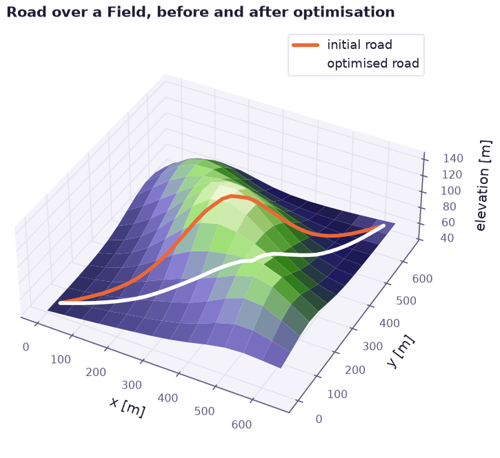
  </picture>
</p>

prophys is a Python library by RhineQC for models that combine geometry, physics and uncertainty in one differentiable graph. You write the model once and then sample it, calibrate it against measurements and optimise a design with the same gradient. Every number comes back with its error bar.

This repository holds a set of examples that use the public API only. They start with a model of a few lines and build up step by step to calibration, sensitivity analysis, stochastic processes and design optimisation. Every example stays within the free tier, so it runs without a license.

## Install

```bash
pip install -r requirements.txt
```

This installs prophys, NumPy and Matplotlib. prophys needs Python 3.11 or newer and brings JAX with it.

## Run

```bash
python examples/01_first_model.py
```

Each script prints its results and writes its figure to `assets` as a light and a dark PNG on a transparent background. Every example runs in a few seconds on a laptop CPU.

## Examples

| Script | What it shows |
| --- | --- |
| [01_first_model](examples/01_first_model.py) | Houses, turbines and an uncertain acceptance drop in one compiled model |
| [02_symbolic_expressions](examples/02_symbolic_expressions.py) | Parameters, expressions and exact gradients through `jax.grad` |
| [03_distributions](examples/03_distributions.py) | Five distribution families and a maximum likelihood fit with `fit_distribution` |
| [04_geometry](examples/04_geometry.py) | Frames, polygons and grids with signed distances and smooth containment |
| [05_monte_carlo_risk](examples/05_monte_carlo_risk.py) | A flood damage model with quantiles, tail risk and Monte Carlo errors |
| [06_calibration](examples/06_calibration.py) | Fitting a cooling law with standard errors, propagation and a profile likelihood |
| [07_design_optimization](examples/07_design_optimization.py) | Placing turbines inside a permitted area with constraints on spacing |
| [08_sensitivity](examples/08_sensitivity.py) | Local elasticities, Sobol indices and a response surface of a beam |
| [09_terrain_route_3d](examples/09_terrain_route_3d.py) | A road over a raster `Field`, optimised to trade climb against length |
| [10_plume_dispersion](examples/10_plume_dispersion.py) | A Gaussian plume under uncertain wind and a map of exceedance probability |
| [11_time_series_process](examples/11_time_series_process.py) | An Ornstein Uhlenbeck process fitted to data and a path dependent quantity |
| [12_power_grid_network](examples/12_power_grid_network.py) | DC power flow under uncertain wind with line reinforcement as binary decisions |

## Gallery

<table>
  <tr>
    <td><picture>
  <source media="(prefers-color-scheme: dark)" srcset="assets/01_first_model_dark.png">
  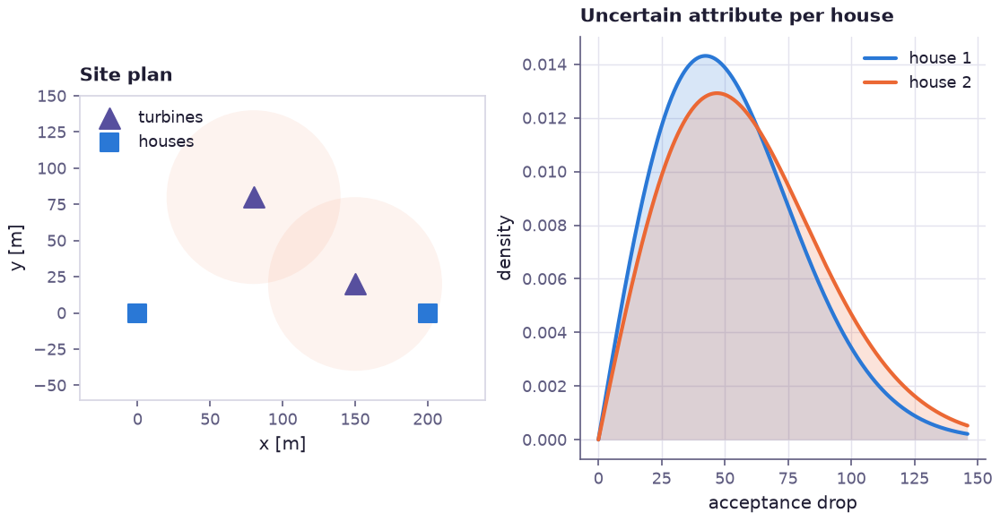
</picture></td>
    <td><picture>
  <source media="(prefers-color-scheme: dark)" srcset="assets/02_symbolic_expressions_dark.png">
  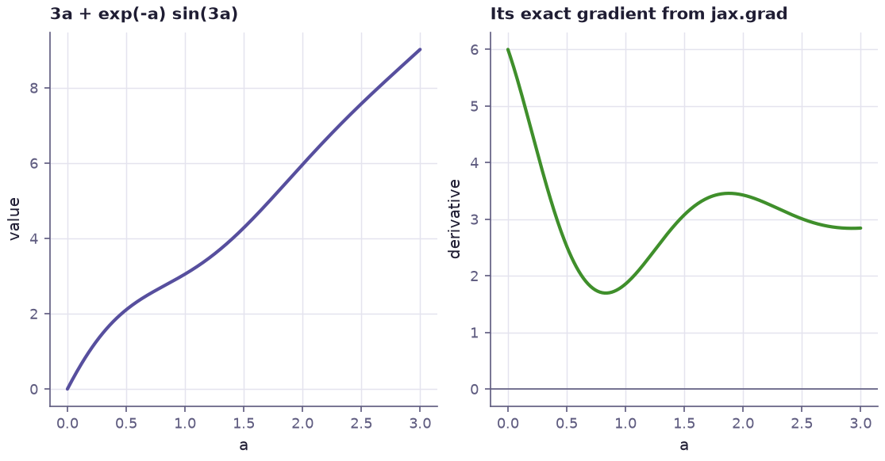
</picture></td>
  </tr>
  <tr>
    <td><picture>
  <source media="(prefers-color-scheme: dark)" srcset="assets/03_distributions_dark.png">
  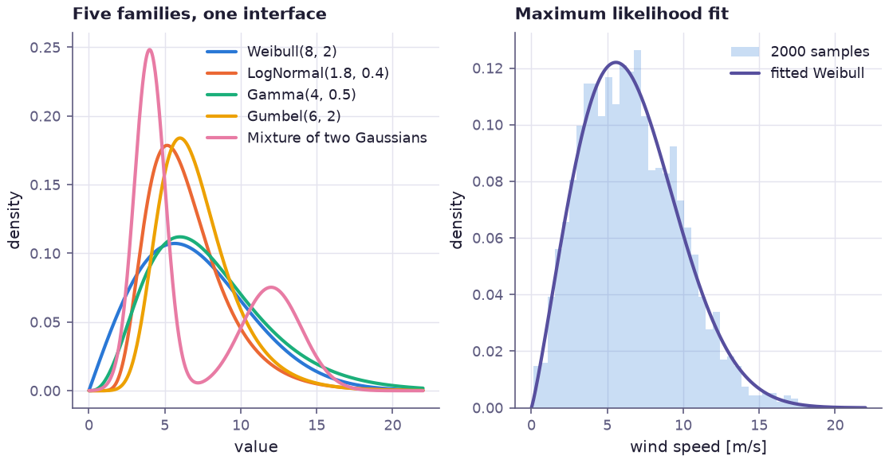
</picture></td>
    <td><picture>
  <source media="(prefers-color-scheme: dark)" srcset="assets/04_geometry_dark.png">
  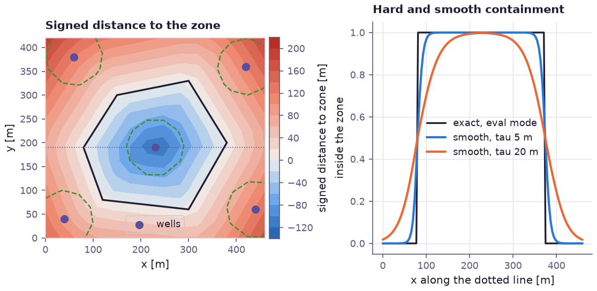
</picture></td>
  </tr>
  <tr>
    <td><picture>
  <source media="(prefers-color-scheme: dark)" srcset="assets/05_monte_carlo_risk_dark.png">
  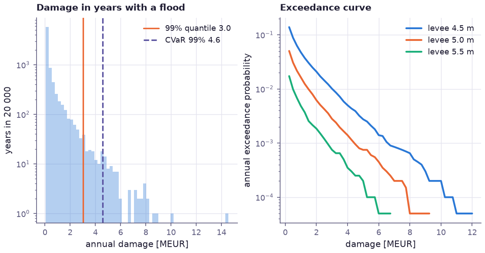
</picture></td>
    <td><picture>
  <source media="(prefers-color-scheme: dark)" srcset="assets/06_calibration_dark.png">
  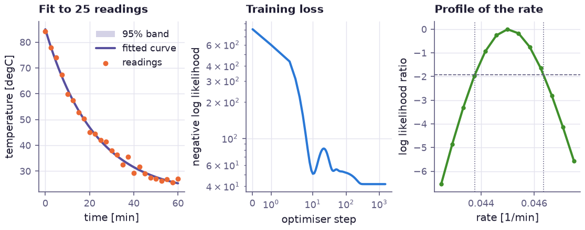
</picture></td>
  </tr>
  <tr>
    <td><picture>
  <source media="(prefers-color-scheme: dark)" srcset="assets/07_design_optimization_dark.png">
  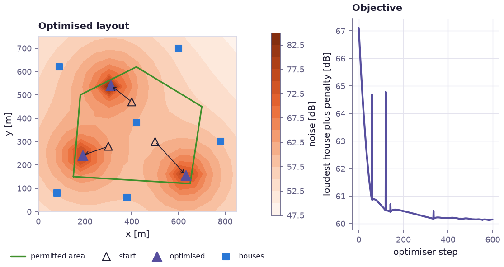
</picture></td>
    <td><picture>
  <source media="(prefers-color-scheme: dark)" srcset="assets/08_sensitivity_dark.png">
  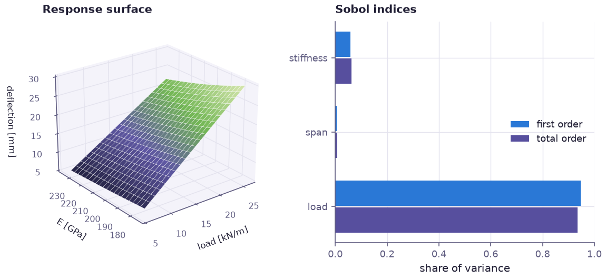
</picture></td>
  </tr>
  <tr>
    <td><picture>
  <source media="(prefers-color-scheme: dark)" srcset="assets/10_plume_dispersion_dark.png">
  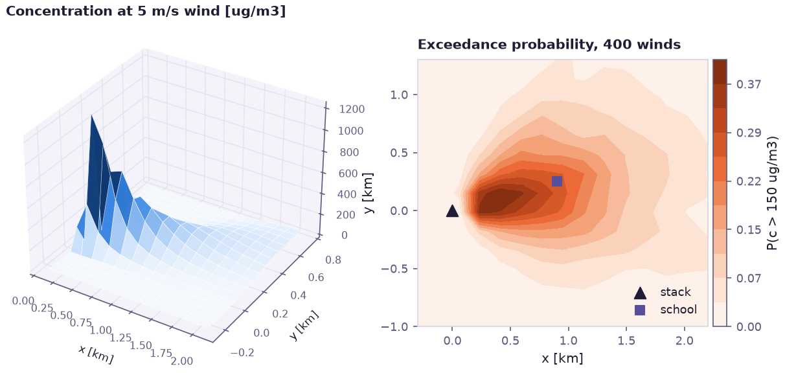
</picture></td>
    <td><picture>
  <source media="(prefers-color-scheme: dark)" srcset="assets/11_time_series_process_dark.png">
  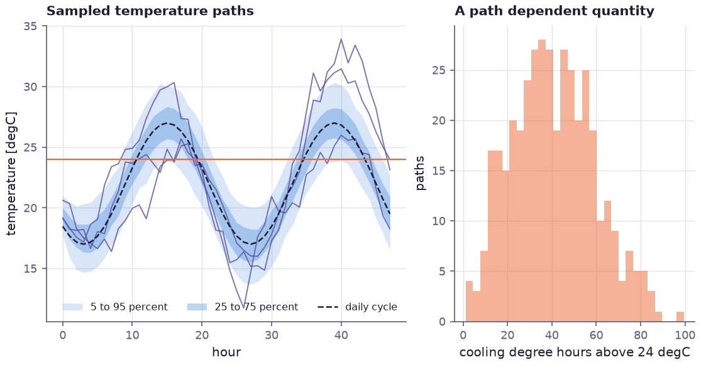
</picture></td>
  </tr>
  <tr>
    <td><picture>
  <source media="(prefers-color-scheme: dark)" srcset="assets/12_power_grid_network_dark.png">
  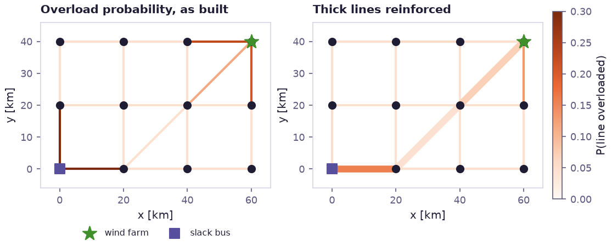
</picture></td>
    <td><picture>
  <source media="(prefers-color-scheme: dark)" srcset="assets/09_terrain_route_3d_dark.png">
  
</picture></td>
  </tr>
</table>

## License

The example scripts and figures in this repository are released under the MIT License, see [LICENSE](LICENSE).

prophys itself is proprietary software by RhineQC GmbH. It includes a free tier for models of up to 250 structural objects, such as points, polygon vertices, raster cells and network nodes. Monte Carlo samples, observations and optimiser steps never count towards that limit. Larger models need a signed license from RhineQC.
